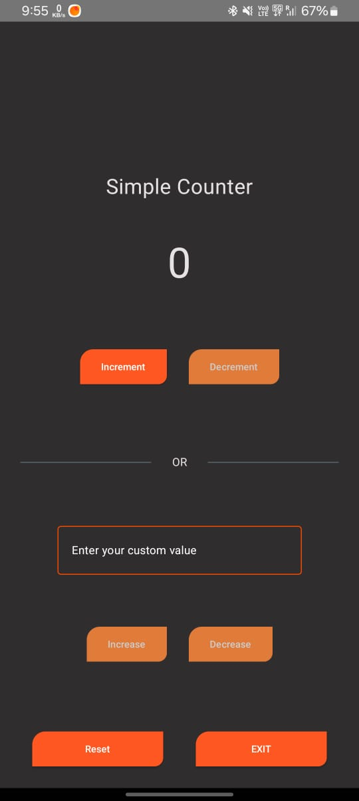
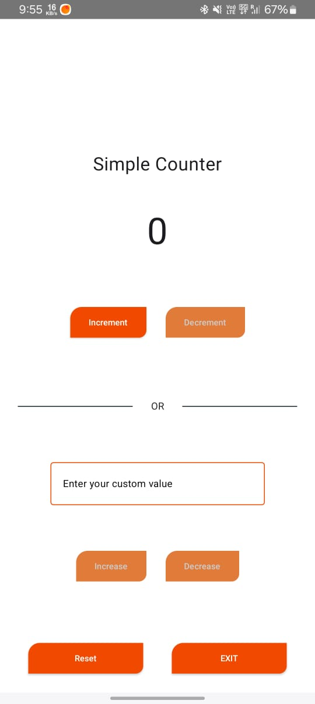

# Simple Counter

  

Minimalistic and elegant counter application made for assistance in counter based scenarios. Whether you need to keep score, track repetitions, or just love counting, this app makes it **simple and fun**!

Usage is very simple! Just launch and play!!!

  
  

## Features ✨
- 🌙 Dark theme (Enabled automatically)
- 📱 Landscape orientation added
- 🎛️ Custom value option, allowing to count from desired number
- 🚫 No ADs, No Signups, No Hidden charges - Just you and your numbers.

## Runtime⚡
- Simply download the package (apk) from Releases section
- Install on your device
- Run the app!!!

> App will be soon launched on App stores like Google Play Store, Fdroid, allowing users to directly install from there.

## Use cases 🧭
- Keeping score in games
- Counting reps during workouts
- Inventory counting
- Habit tracking
- Or just for fun!

## Language, Frameworks & Tools used 🛠️
- Ultimate IDE: Android Studio
- Build tool: Gradle
- UI Toolkit: Jetpack Compose
- Core Language: Kotlin

## Privacy 🔐
No internet, nothing userdata is collected, this is just a counter application.

## Contributions 🤝
Your contributions are welcome! If you find any issues or want to add enhancements, feel free to submit a pull request.

## License 📝
This project is licensed under the 
